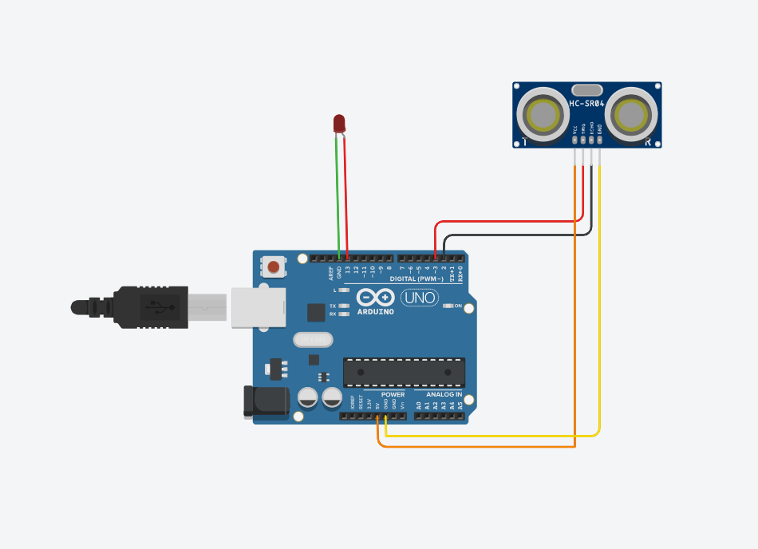

# Arduino - QT Project

This is a simple project made by integrating different python and Qt libraries.
Below is the chart,that give you a complete overview of working mechanism.

## Working Chart

## Circuit Diagram

 
